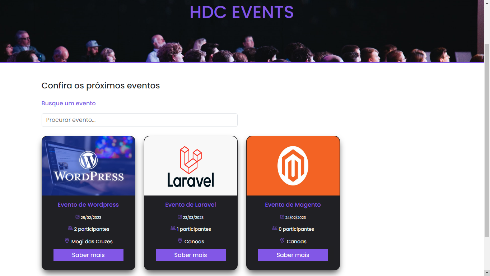

<h1 align="center"> HDC Events </h1>

Essa platoforma foi desenvolvida com o intuito de aprofundar os conhecimentos no Framework Laravel e PHP

  <a href="#-tecnologias">Tecnologias</a>&nbsp;&nbsp;&nbsp;|&nbsp;&nbsp;&nbsp;
  <a href="#-projeto">Projeto</a>&nbsp;&nbsp;&nbsp;|&nbsp;&nbsp;&nbsp;
  <a href="#-layout">Layout</a>&nbsp;&nbsp;&nbsp;|&nbsp;&nbsp;&nbsp;
  <a href="#memo-licença">Licença</a>

  

 

  

## 🚀 Tecnologias

Esse projeto foi desenvolvido com as seguintes tecnologias:

-   PHP 7.4.1;
-   HTML 5;
-   CSS3;
-   Bootstrap versão 5.2.2;
-   Laravel;
-   Banco de dados SQL;
-   Git e Github;
-   Tailwind;
-   Artisan ( Para emular o servidor e abrir a aplicação );
-   Dashboard ( Usado o pacote Livewire e seus componentes);

## 💻 Projeto

O projeto foi feito com o intuito de estudar o framework PHP Laravel, para implementar em diversos projetos diferentes.
Fiz com a possíbilidade de qualquer usuário da internet consiga criar e participar dos eventos cadastrados, além de todas funcionalidades usando CRUD.

## :memo: Licença

Esse projeto está sob a licença MIT.

---

Feito com ♥ by Vanderlei

# hdc-events
